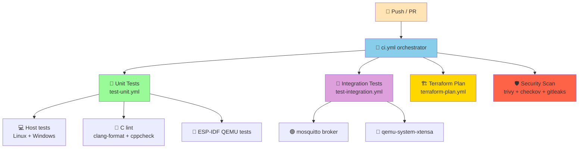

# 🧪 Testing Guide

This repo has **two test layers** plus a `ci.yml` orchestrator that runs both on every PR.



## 🧪 Unit tests — `tests/host/`

Host-based tests that compile the **real C source** against a small set of stubs for FreeRTOS, ESP-IDF GPIO, and ESP logging. No toolchain, no AWS, no device — runs in seconds on any platform with a C compiler.

```bash
cmake -S tests/host -B tests/host/build -DCMAKE_BUILD_TYPE=Debug
cmake --build tests/host/build -j
ctest --test-dir tests/host/build --output-on-failure
```

| File | What it covers |
|------|----------------|
| `test_movement_driver.c` | init creates queue + task, configures pins, runs boot-blink, installs ISR handler |
| `test_mqtt_aws.c` | init/publish contracts (currently stubbed) |
| `test_sensor_pipeline.c` | end-to-end init sequence + multi-publish |

## 🧪 ESP-IDF component tests — `tests/component/`

Runs the **real** FreeRTOS scheduler + the **real** ESP-IDF GPIO driver on `qemu-system-xtensa` (no hardware required). Uses the Unity test framework bundled with ESP-IDF.

```bash
cd tests/component/movement_driver
idf.py set-target esp32
idf.py build
qemu-system-xtensa -nographic -machine esp32 \
  -drive file=build/movement_driver_component_test.bin,if=mtd,format=raw
```

## 🔗 Integration tests — `tests/integration/`

The closest thing to a real device test you can run in CI. The integration test project:

1. Brings up a local `mosquitto` broker as a service container.
2. Compiles the production firmware into a QEMU-emulated ESP32.
3. Runs the full pipeline (init → motion event → publish → re-init).
4. Asserts the broker receives the expected payload.

## 🏗️ Terraform plan — `terraform-plan.yml`

On every PR that touches `infrastructure/`:

- Assumes the deploy role via OIDC.
- Runs `terraform fmt -check`, `terraform validate`, `tflint`, `trivy`, `checkov`.
- Runs `terraform plan` and uploads the binary plan as an artifact for review.

## 🚀 Terraform apply — `terraform-apply.yml`

- **Push to `main` → auto-apply to `dev`.**
- **Manual `workflow_dispatch` → choose environment.** Prod is gated by a GitHub Environment with required reviewers.

## 🧨 Terraform destroy — `terraform-destroy.yml`

Manual-only workflow that requires typing `destroy` to confirm. Use it for cleaning up dev environments, never prod.

## 🛡️ Security scan — `ci.yml` security job

- **Trivy** — IaC misconfigurations, known CVEs in Terraform providers.
- **Checkov** — policy-as-code checks (encryption, public access, etc).
- **gitleaks** — secret scanning on every commit.

## 🖥️ Running tests locally

### Unit tests
```bash
cmake -S tests/host -B tests/host/build
cmake --build tests/host/build
ctest --test-dir tests/host/build --output-on-failure
```

### Component + integration tests (requires ESP-IDF)
```bash
# Install ESP-IDF v5.2 once: https://docs.espressif.com/projects/esp-idf/
. $HOME/esp/esp-idf/export.sh

# Component test
cd tests/component/movement_driver
idf.py build
qemu-system-xtensa -nographic -machine esp32 \
  -drive file=build/movement_driver_component_test.bin,if=mtd,format=raw

# Integration test (with local mosquitto)
docker run -d -p 1883:1883 eclipse-mosquitto:2
cd ../../integration
idf.py build
qemu-system-xtensa -nographic -machine esp32 \
  -drive file=build/sensor_access_integration_test.bin,if=mtd,format=raw
```

### Terraform plan
```bash
export AWS_PROFILE=dev
cd infrastructure
terraform init -backend=false
terraform validate
terraform plan
```

## 🎯 What each layer catches

| Layer | Catches | Misses |
|-------|---------|--------|
| 🧪 Host unit | Logic bugs in driver, queue state, init order | Real-time ISR timing, real GPIO behaviour |
| 🧪 ESP-IDF QEMU | Real RTOS interaction, real ESP-IDF GPIO driver, real ISR | Wi-Fi / TCP stack differences from real hardware |
| 🔗 Integration | End-to-end pipeline correctness, broker contract | Hardware-specific quirks (power, antenna, sensor noise) |
| 🏗️ Terraform plan | IaC syntax, policy misconfig, security issues | Runtime behaviour, IAM permission gaps |
| 🛡️ Security scan | Known CVEs, exposed secrets, weak policies | Custom business-logic risks |

> 🏆 A senior DevOps engineer layers these tests deliberately — each one covers a different failure mode the layer below would miss.
