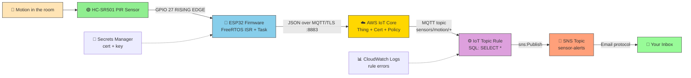
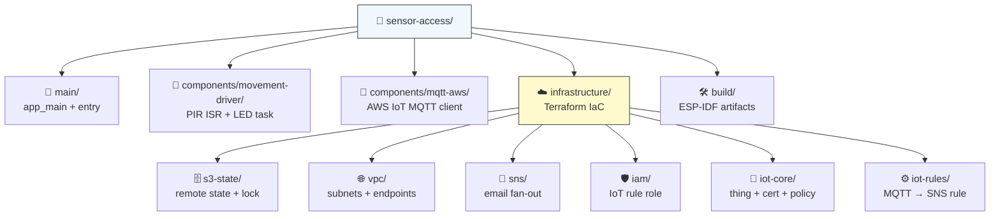
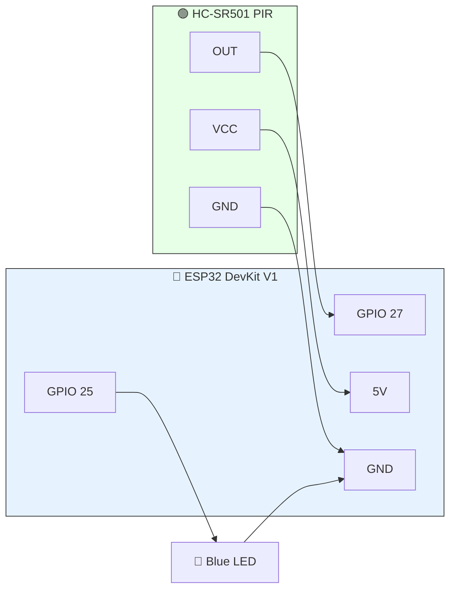
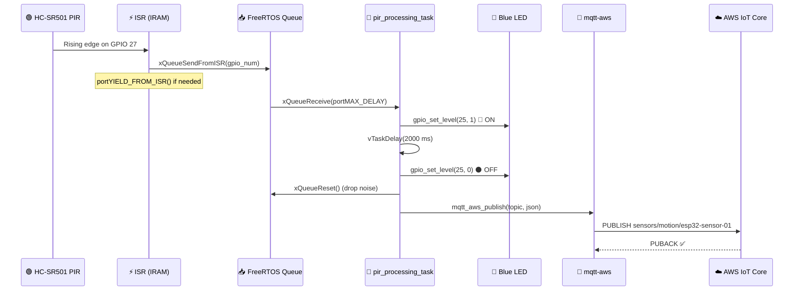
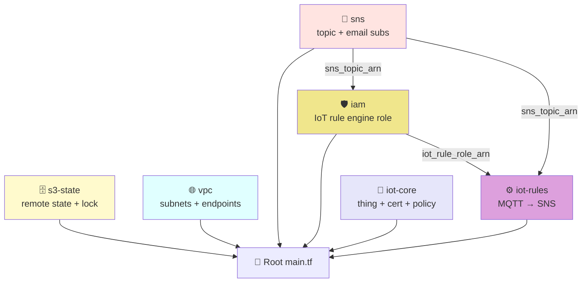
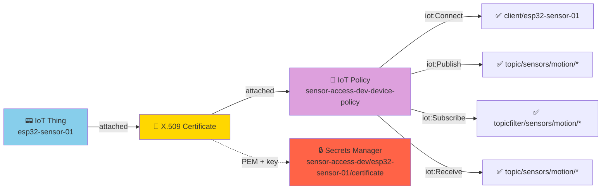
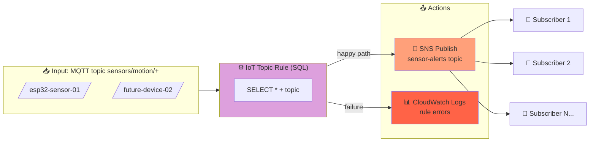
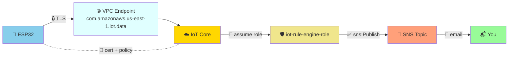
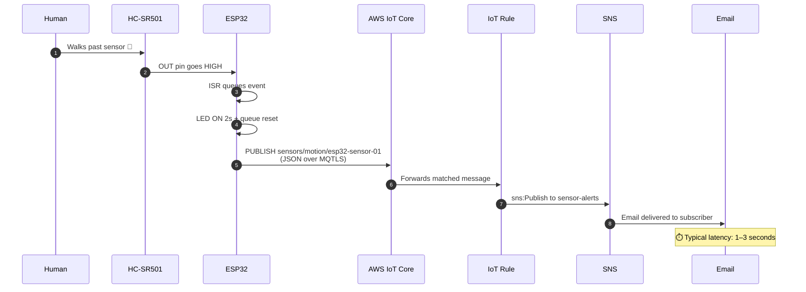
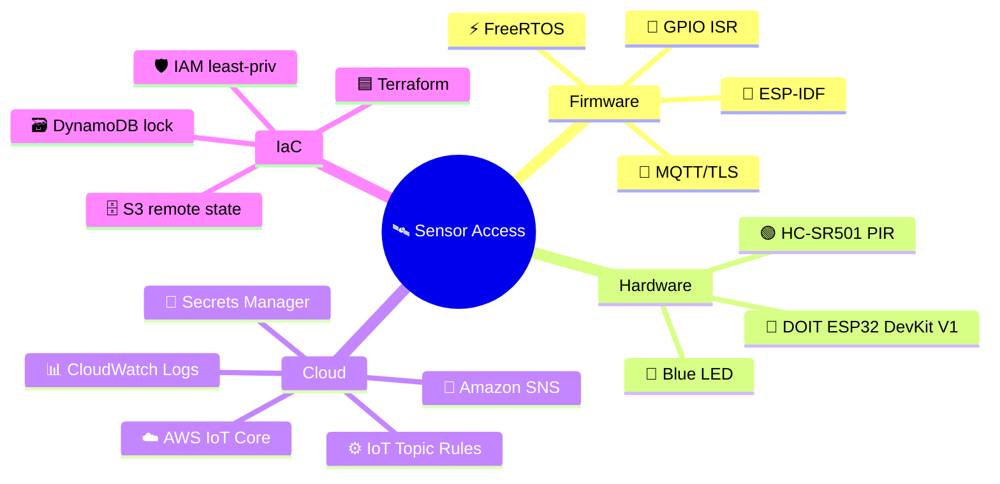

# 🛰️ Sensor Access — IoT Motion Alert Pipeline

> **A pocket-sized, end-to-end IoT pipeline that watches a doorway and pings your inbox the instant someone walks in.** 🚨📩

An **ESP32** paired with an **HC-SR501 PIR motion sensor** detects physical movement, publishes an event over **MQTT** to **AWS IoT Core**, where an **IoT Topic Rule** fans the event out to **Amazon SNS**, delivering an email alert in seconds.

Built with embedded C (ESP-IDF) on the device side and Terraform-managed AWS infrastructure on the cloud side. ✨

---

## 🎯 What This Project Does

| Step | What happens | Who does it |
|------|--------------|-------------|
| 1️⃣ | A human (or a cat 🐈) walks past the sensor | HC-SR501 PIR |
| 2️⃣ | The PIR output pin goes HIGH on GPIO 27 | ESP32 ISR |
| 3️⃣ | A FreeRTOS task wakes up, blinks the blue LED 🔵 for 2s | ESP32 firmware |
| 4️⃣ | A JSON payload is published over MQTT/TLS to AWS IoT Core | `mqtt-aws` component |
| 5️⃣ | An IoT Topic Rule matches `sensors/motion/+` and triggers an action | AWS IoT Rules Engine |
| 6️⃣ | The payload is published to an SNS topic | SNS |
| 7️⃣ | SNS fans out to every confirmed email subscriber | You 📬 |

---

## 🏗️ High-Level Architecture



---

## 🧩 Repository Layout



| Path | Purpose | Tech |
|------|---------|------|
| `main/main.c` | App entry point — boots PIR driver, idle-loops | ESP-IDF, FreeRTOS |
| `components/movement-driver/` | PIR GPIO interrupt, queue, LED blink | C, FreeRTOS |
| `components/mqtt-aws/` | MQTT connect/publish stub (ready to wire) | C |
| `infrastructure/` | AWS infrastructure as code | Terraform |
| `infrastructure/modules/iot-core/` | Thing, certificate, policy, Secrets Manager | AWS IoT |
| `infrastructure/modules/iot-rules/` | SQL rule that routes MQTT → SNS | AWS IoT Rules |
| `infrastructure/modules/sns/` | Topic + email subscriptions | SNS |
| `infrastructure/modules/iam/` | Least-privilege role for the rule engine | IAM |
| `infrastructure/modules/vpc/` | Subnets, IGW, VPC endpoints (future-proof) | VPC |
| `infrastructure/modules/s3-state/` | Encrypted remote state + DynamoDB lock | S3 + DynamoDB |

---

## ⚡ The Device Side — ESP32 Firmware

### 🔌 Hardware Wiring



| Component | ESP32 Pin | Notes |
|-----------|-----------|-------|
| PIR VCC | 5V | HC-SR501 needs 5V |
| PIR OUT | **GPIO 27** | Input, pull-down, rising-edge interrupt |
| PIR GND | GND | Common ground |
| Blue LED (+) | **GPIO 25** | Output, sinks to GND through resistor |

### 🔁 Runtime Flow



### 🧠 Key Implementation Details

- **ISR runs in IRAM** — minimal latency, only enqueues a `uint32_t` to avoid blocking the CPU.
- **FreeRTOS queue** (`xQueueCreate(10, sizeof(uint32_t))`) decouples the ISR from the work loop.
- **Debounce window** — the task holds the LED on for 2 s and then `xQueueReset`s the queue, so back-to-back triggers from the same motion event don't spam the broker. 🧹
- **Boot blink** — LED flashes for 500 ms at startup as a hardware sanity check. ✅

---

## ☁️ The Cloud Side — AWS Infrastructure (Terraform)

### 🧱 Module Dependency Graph



### 🛰️ IoT Core — The Device Identity Plane



> 🔒 The certificate, public key, and **private key** never touch the repo — Terraform creates them and ships them to **AWS Secrets Manager**. Flash them onto the ESP32 from there at provisioning time.

### ⚙️ The IoT Topic Rule — The Brain of the Pipeline

```sql
SELECT *, topic() AS mqtt_topic
FROM   'sensors/motion/+'
```



> 🛡️ The rule engine assumes a dedicated IAM role (`sensor-access-dev-iot-rule-engine-role`) with `sns:Publish` scoped to **only** the sensor alerts topic. Failures fall through to a CloudWatch log group with 14-day retention.

### 📬 Expected Email Payload Shape

The full JSON body sent by the device becomes the email body:

```json
{
  "device_id": "esp32-sensor-01",
  "timestamp": "2026-07-10T11:00:00Z",
  "event":     "motion_detected",
  "ttl":       1757000000
}
```

---

## 🔐 Security Model 🛡️

| Layer | Control | Why it matters |
|-------|---------|----------------|
| 🔐 Transport | MQTT over **TLS 1.2** (port 8883) | ESP32 → AWS IoT Core is encrypted in transit |
| 🪪 Identity | **X.509 certificate** per device | No shared secrets, easy to revoke |
| 📜 Authorization | **Least-privilege IoT policy** | Device can only use its own client ID and topic subtree |
| 🤖 Rule engine | Dedicated IAM role with `sns:Publish` scoped to one ARN | Blast radius is one topic |
| 🗄️ State | S3 bucket versioning + KMS encryption + DynamoDB lock | State can't be lost or corrupted by parallel runs |
| 🌐 Network (future) | VPC endpoints for IoT Data + DynamoDB | Private subnets never traverse the public internet |
| 🚫 Secrets | Certs in **AWS Secrets Manager**, not git | Zero secrets in source control |



---

## 🚀 End-to-End Sequence — From Wave to Inbox



---

## 🧰 Tech Stack



| Domain | Tool | Why |
|--------|------|-----|
| 🧠 Embedded | ESP-IDF + FreeRTOS | First-class on ESP32, deterministic ISRs |
| 📡 Messaging | MQTT over TLS | Lightweight, perfect for constrained devices |
| ☁️ IoT broker | AWS IoT Core | Managed, scales to billions, no server to run |
| ⚙️ Routing | IoT Topic Rules | SQL-style filtering without writing a Lambda |
| 📣 Notifications | Amazon SNS | One-to-many fan-out, email ready out of the box |
| 🟦 IaC | Terraform | Repeatable infra, remote state, plan/apply workflow |
| 🗄️ State | S3 + DynamoDB | Encrypted, versioned, locked — production-grade |

---

## 🩺 Operational Notes

- **Bootstrapping the backend** — the first `terraform apply` runs against a *local* state to create the S3 bucket + DynamoDB lock table, then a one-time `terraform init -migrate-state` moves state to S3. (See comments in `infrastructure/main.tf`.)
- **Email confirmation** — AWS emails every new SNS subscriber a one-time confirmation link. Until it's clicked, the email stays silent. 📭
- **Error visibility** — if the SNS publish ever fails, the rule's `error_action` ships the failure to `/aws/iot/sensor-access-dev/rule-errors` in CloudWatch (14-day retention). 🪵
- **Cost posture** — IoT Core charges per message, SNS per notification, S3 + DynamoDB are pay-per-request. This pipeline costs **pennies per month** at low traffic. 💸
- **Scaling out** — drop more `aws_iot_thing` + certificate resources per device; the topic rule already matches `sensors/motion/+` so any new device ID works automatically. ➕

---

## 🔮 Future-Proofing (Already in the IaC!)

- 🌐 **VPC + subnets** are provisioned with **VPC endpoints** for IoT Data and DynamoDB, so future workloads (Lambda, ECS, RDS) can talk to AWS services without traversing the public internet.
- 🗃️ A **DynamoDB table** schema (`device_id` partition + `timestamp` sort + TTL) is ready to be wired into a future "log every motion event" Lambda. 📈
- 🛡️ IAM roles are **per-purpose** and **least-privilege** — adding a new action means attaching a new policy, not loosening an existing one. 🔒

---

## 📜 License

See `LICENSE` in the repo root. ⚖️

---

> **TL;DR** 🧾 — PIR sensor says "movement!" ➡️ ESP32 blinks an LED and publishes to AWS IoT Core ➡️ a serverless rule forwards to SNS ➡️ you get an email. Cheap, secure, repeatable, and entirely under your control. 🎉
